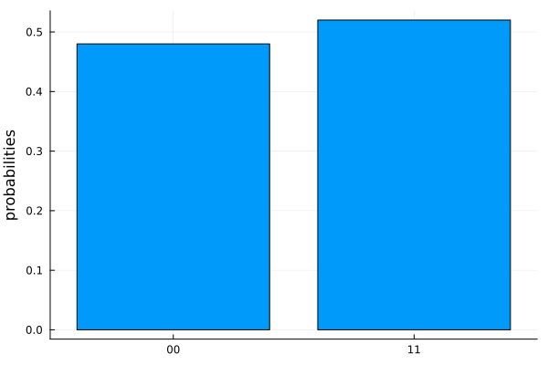

# Getting Started

```@meta
DocTestSetup = quote
    ENV["ANYON_QUANTUM_USER"] = "test-user"
    ENV["ANYON_QUANTUM_TOKEN"] = "not-a-real-token"
    ENV["ANYON_QUANTUM_HOST"] = "yukon.anyonsys.com"
end
```


## Typical workflow

A typical workflow to execute a quantum circuit on a quantum service consists of these three steps.

- Create: Build the circuit using quantum gates.

- Transpile: Transpile the circuit to improve performance and make the circuit compatible with the quantum service.

- Execute: Run the compiled circuits on the specified quantum service. The quantum service could be a remote quantum hardware or a local simulator.

## Create a Circuit
Now, let's try Qanuk by making a two-qubit circuit which implements a [Bell/EPR state](https://en.wikipedia.org/wiki/Bell_state). The quantum circuit for generating a Bell state involves a Hadamard gate on one of the qubits followed by a CNOT gate (see https://en.wikipedia.org/wiki/Quantum_logic_gate for an introduction to quantum logic gates). This circuit is shown below:

```@raw html
<div style="text-align: center;">
	
</div>
```
First import Qanuk:

```jldoctest getting_started; output = false
using Qanuk

# output

```

With Qanuk imported, we can define our two-qubit circuit.

```jldoctest getting_started
c = QuantumCircuit(qubit_count=2)
print(c)

# output

Quantum Circuit Object:
   qubit_count: 2
q[1]:

q[2]:
```

In Qanuk, all qubits start in state $\left|0\right\rangle$. Our circuit is, therefore, in state $\left|00\right\rangle$. We now proceed by adding gates to our circuit.

```jldoctest getting_started
push!(c, hadamard(1), control_x(1, 2))
print(c)

# output
Quantum Circuit Object:
   qubit_count: 2
q[1]:──H────*──
            |
q[2]:───────X──
```

The first line adds a Hadamard gate to circuit object `c` which will operate on qubit 1. The second line adds a CNOT gate (Control-X gate) with qubit 1 as the control qubit and qubit 2 as the target qubit.

!!! note
	Unlike C++ or Python, indexing in Julia starts from "1" and not "0"!

## Simulate your circuit

The next step we want to take is to simulate our circuit. We do not need to transpile our circuit since our simulator can handle all gates, but for larger circuit you should consider transpilation to reduce the amount of work the simulator has to perform.

```jldoctest getting_started
ψ = simulate(c)
print(ψ)

# output
4-element Ket{ComplexF64}:
0.7071067811865475 + 0.0im
0.0 + 0.0im
0.0 + 0.0im
0.7071067811865475 + 0.0im
```

Finally, you can use [SnowflakePlots](https://github.com/anyonlabs/SnowflakePlots.jl) to generate a histogram which shows the measurement
output distribution after taking a certain number of shots, in this case 100, on a quantum
computer simulator:

```julia
using SnowflakePlots
plot_histogram(c, 100)
```


The script below puts all the steps above together:

```julia
using Qanuk, SnowflakePlots

c = QuantumCircuit(qubit_count=2)
push!(c, [hadamard(1)])
push!(c, [control_x(1, 2)])

ψ = simulate(c)

plot_histogram(ψ, 100)
```

## Execute on Anyon's hardware

Let's see how how to run the circuit created in the previous section on real hardware. At 

We want to interact with Anyon's Quantum Computers, so we are going to construct an `AnyonQPU`. Three things are needed to construct an `AnyonQPU`. We need the username and access token to authenticate with the quantum computer and the hostname where the quantum computer can be found. The easiest way to get these parameters is by reading them from environment variables. For more information on QPU objects please go to the [Get QPU Metadata tutorial](./tutorials/introductory/get_qpu_metadata.md).

```jldoctest getting_started
user = ENV["ANYON_QUANTUM_USER"]
token = ENV["ANYON_QUANTUM_TOKEN"]
host = ENV["ANYON_QUANTUM_HOST"]

qpu = AnyonQPU(host=host, user=user, access_token=token)
print(qpu)

# output
Quantum Processing Unit:
   manufacturer:  Anyon Systems Inc.
   generation:    Yukon
   serial_number: ANYK202201
   qubit_count:   6
   connectivity_type:  linear
```

We can now run our circuit with

```julia
num_repetitions = 200
result = transpile_and_run_job(qpu, circuit, num_repetitions)
```

and plot the results with

```julia
plot_histogram(result)
```


The script below puts all the steps above together:

```julia
using Qanuk, SnowflakePlots

user = ENV["ANYON_QUANTUM_USER"]
token = ENV["ANYON_QUANTUM_TOKEN"]
host = ENV["ANYON_QUANTUM_HOST"]

qpu = AnyonQPU(host=host, user=user, access_token=token)

circuit = QuantumCircuit(qubit_count=2)
push!(circuit, [hadamard(1)])
push!(circuit, [control_x(1, 2)])

num_repetitions = 200
result = transpile_and_run_job(qpu, circuit, num_repetitions)

plot_histogram(result)
```

## More information

For more information head over to our [Tutorials page](./tutorials/index.md) or our [Library reference page](./library.md).
