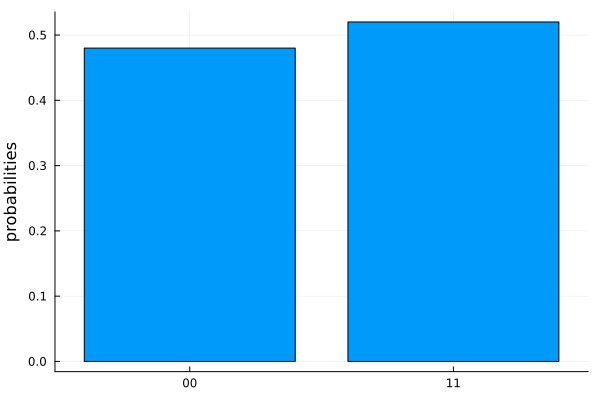

# Basic Concepts
In this tutorial, we introduce basic concepts and objects that are used in Qanuk. 


## Quantum Circuits
In quantum computing, a *quantum circuit* represents a sequence of operations that are intended to be applied to qubits.

Let's start by an example. 
We are going to start by importing Qanuk.

```jldoctest basics; output = false
using Qanuk
# output

```

We can then create an empty quantum circuit by specifying the number of qubits the circuit will involve:

```jldoctest basics; output = false
c=QuantumCircuit(qubit_count=2)
# output
Quantum Circuit Object:
   qubit_count: 2 
q[1]:
     
q[2]:
     


```
At anypoint, you can visualize a `QuantumCircuit` object by simply printing it:

```jldoctest basics; output=true
print(c)
# output
Quantum Circuit Object:
   qubit_count: 2 
q[1]:
     
q[2]:
     

```
We have not yet added any quantum operation to our circuit and it looks empty! So, let's make this circuit a bit more interesting.

!!! note
	In Qanuk, we assume all qubits are initialized to be in state 0 (ground state). 

## Quantum Gates

Basic logical operations on qubits are commonly called *quantum logic gates* or simply *gates*. We will quite often talk about *single-qubit gates*, *two-qubit gates* or *multiple-qubit* gates in quantum information theory.

Let's start by adding a gate called the *Hadamard* gate to our circuit, `c`, and specify that it will only operate on qubit '1'. We will do so by calling the `push!` function:
```jldoctest basics; output=false
push!(c,hadamard(1))
# output
Quantum Circuit Object:
   qubit_count: 2 
q[1]:──H──
          
q[2]:─────

```
!!! note
	Unlike C++ or Python, indexing in Julia starts from "1" and not "0"!

Note the exclamation mark at the end of `push!` which emphasizes the fact that we have called a mutating function that will change the argument `c` (our quantum circuit). 

If we now `print` circuit `c`, we will see the following output
```jldoctest basics; output=true
print(c)
# output
Quantum Circuit Object:
   qubit_count: 2 
q[1]:──H──
          
q[2]:─────

```

Now let's add a famous two-qubit gate, `control_x`, also known as the *CNOT* gate in the quantum information community: 
 ```jldoctest basics; output=true
push!(c,control_x(1,2))
# output
Quantum Circuit Object:
   qubit_count: 2 
q[1]:──H────*──
            |  
q[2]:───────X──
               
```
Voila! You just made your first quantum circuit with `Qanuk` that does something interesting:

It puts a two-qubit register in a maximally-entangled quantum state ($\frac{\left|00\right\rangle+\left|11\right\rangle}{\sqrt{2}}$). This sate is one of the four celebrated  [Bell State](https://en.wikipedia.org/wiki/Bell_state) or the EPR states. These states do not have classical counterparts and are are among the building blocks of many interesting ideas in quantum computing and quantum communication.

## Circuit Simulation
You can verify what your circuit will ideally do on a real computer by simulating the circuit on your own local machine:
```jldoctest basics; output=true
simulate(c)
# output
4-element Ket{ComplexF64}:
0.7071067811865475 + 0.0im
0.0 + 0.0im
0.0 + 0.0im
0.7071067811865475 + 0.0im
```

The output of `simulate` function is a `Ket` object. `Ket` is a complex vector that represents the wavefunction of a quantum object such as our two-qubit system. 

## Histogram
In the previous section, we used the `simulate` function to calculate the wavefunction of a two-qubit quantum register, after the circuit, `c`, is applied to it. However, in the real world, we do not have direct access to the wavefunction of a quantum register. Rather, we need to run the quantum circuit many many times (shots) on the quantum processor and measure the qubits states at the end of each shot. The result of each shot is a bitstring that tells us which qubits were measured to be in state `0` and which qubits were measured to be in state `1`. The probability of getting a bitstring then depends on the wavefunction. 

We can indeed mimick this behaviour in our simulations as well.  This can be achieved by using the `plot_histogram` function from the [SnowflakePlots](https://github.com/anyonlabs/SnowflakePlots.jl) library.  For example, we can generate a histogram which shows the measurement
output distribution after taking running the circuit `c` for a given number of shots, let's say 100 times, on a quantum
computer simulator:

```julia
using SnowflakePlots
plot_histogram(c, 100)
```


In the next tutorial, we will discuss how to run the above circuit on a real quantum processor. 